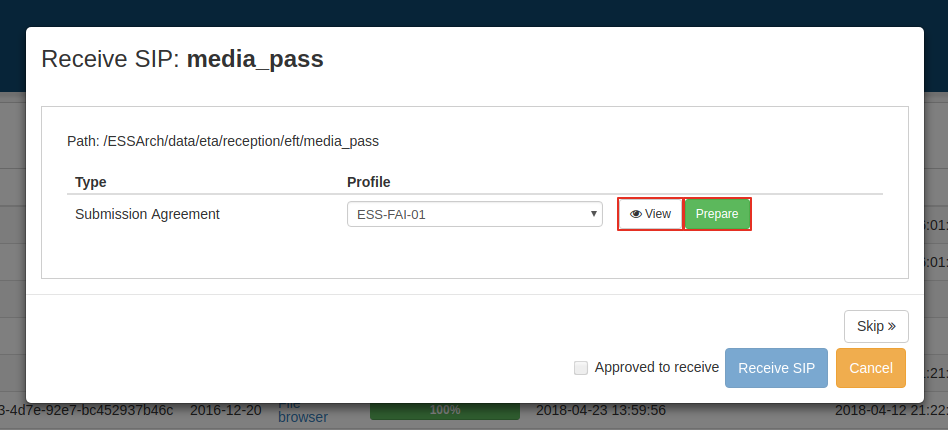
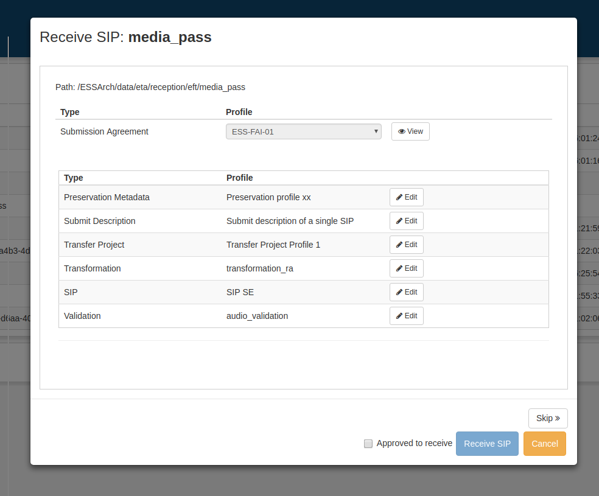
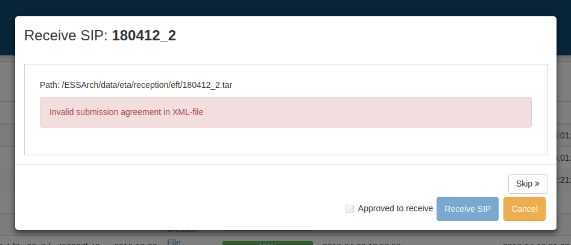
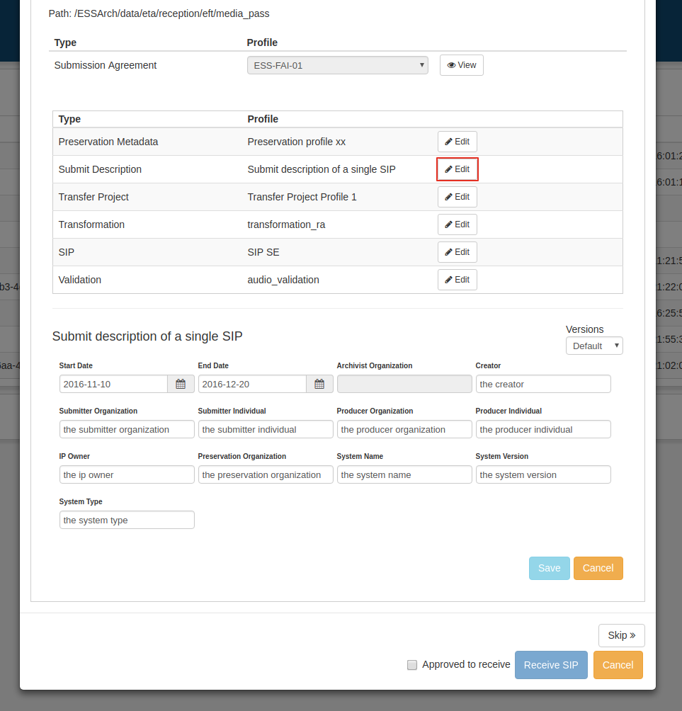
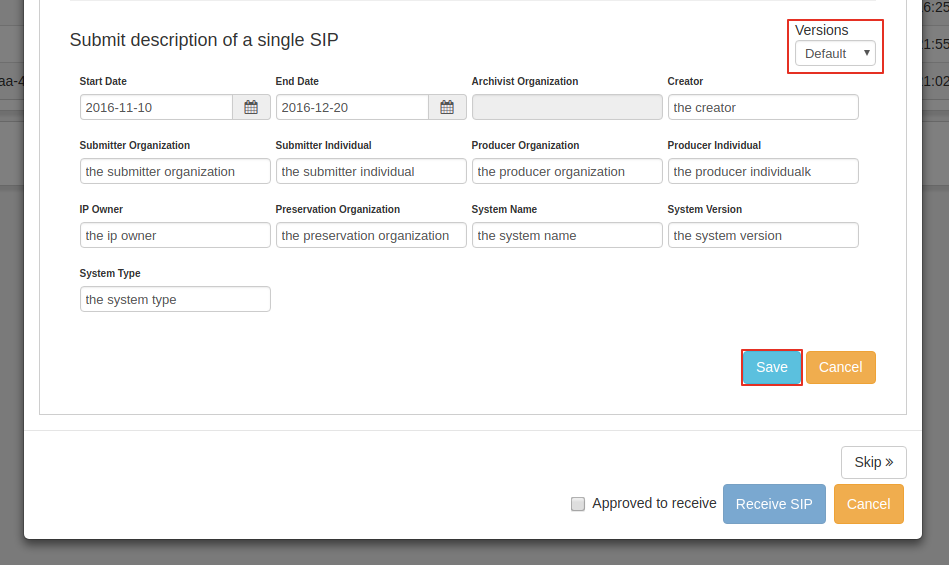
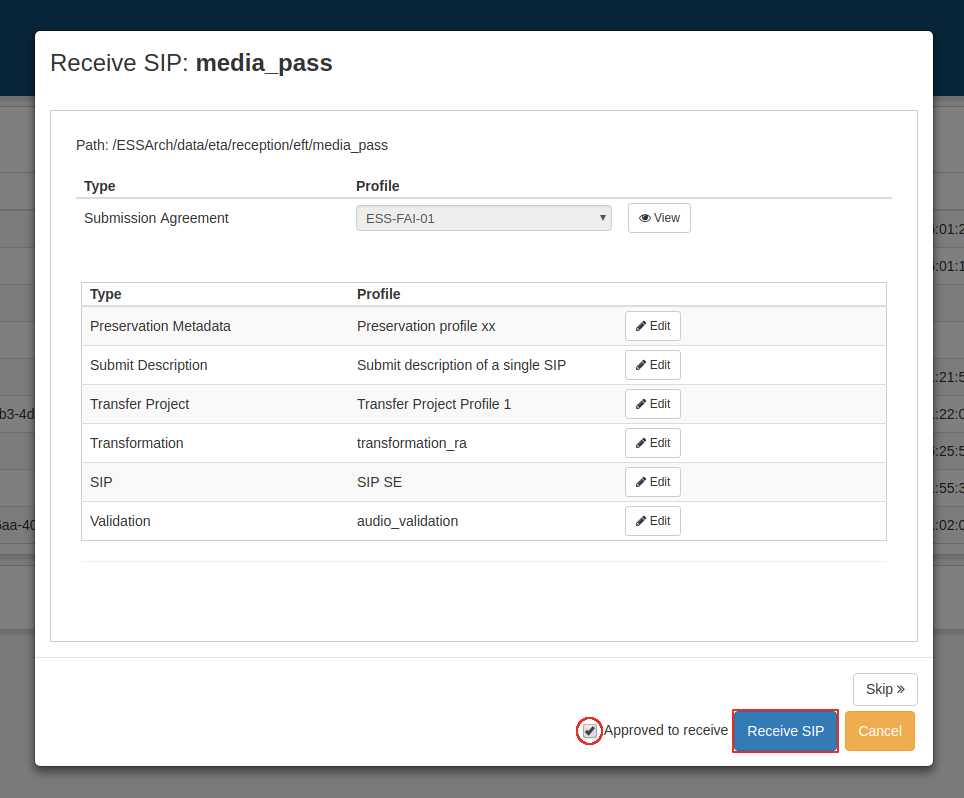

.. _reception:

******************
 Reception
******************

Receive SIP is the first step in ETA.
IPs that have arrived to the ETA reception are listed in the
reception list view.

Receive
=======

To receive an IP, check the checkbox at the start of the table row of the
IP to include it for receive. Many IPs can be selected at the same time.

.. image:: images/reception_checkbox.png

When desired IPs are included click the **Receive**-button in the
bottom right corner.

.. image:: images/reception_receive_button.png

Clicking the **Receive**-button will open a window to receive the first
included IP.

Profile Editor
--------------

Use the select dropdown to choose what submission agreement to use,
then click **Prepare**.

If the dropdown is disabled, the IP already has a related Submission agreement.

If IP in reception has a defined Submission Agreement that does not exist
in the database, an error message is shown.

The profile editor is where the user can edit data of a profile for a specific IP.
The Submission agreements data fields can only be viewed by clicking
the **view** button next to the SA dropdown.

Underneath the Submission agreement row, all relevant profiles are listed.
Click **edit** next to a profile to edit the data of the profile for the
IP to be received.

When satisfied with the edit click **Save**.

When saving profile data, the previous versions are still available in the
version dropdown. Choose between data versions and click save to apply.

This can be done on each profile type, remember to save the data before
closing the profile form.

Receive
-------

When selection of Submission agreement and profiles is done.
Check the **Approved to receive**-checkbox and click **Receive SIP**.
The process of receiving the IP is started and if more IPs are included a
receive window for the next IP will appear.
An IP can be skipped by clicking the **Skip**-button,
then the receive window for the next included IP will appear,
if there is one.

When IP is received it is no longer visible in the reception list view and
can be found in either Workarea list views or the list view in Transfer SIP.
