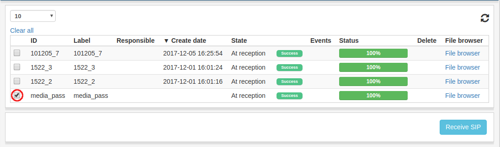
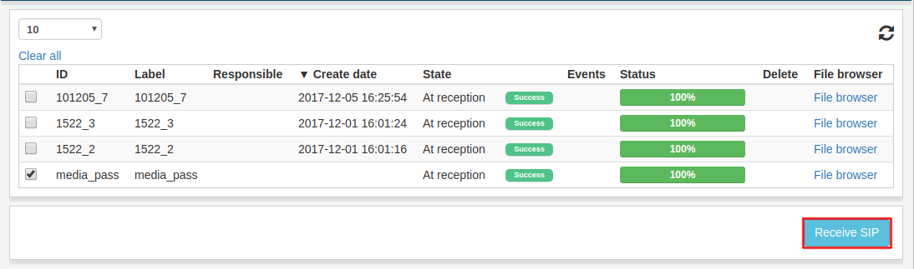
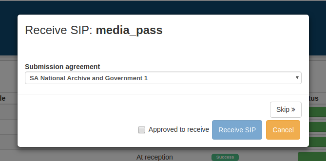
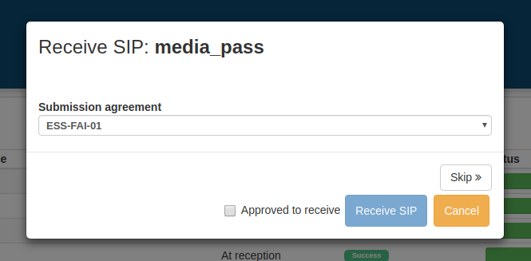

.. _reception:

******************
 Reception
******************

Ta emot SIP är det första steget i ETA. IPn som har kommit till
ETAs reception finns listade id receptionens listvy.

Ta emot
=======

För att ta emot ett IP, markera kryssruran i början på IPts rad
för att markera det för mottagande. Flera IPn kan väljas samtidigt.

När alla IPn som ska tas emot är markerade klicka på **Ta emot**
nere till höger.

När **Ta emot** klickas kommer ett fönster för att ta emot det första IPt
som valdes.

Använd rullistan för att välja leveransöverenskommelse som ska användas.
Om rullistan är inaktiverad så är IPt redan kopplat till en
leveransöverenskommelse.

När leveransöverenskommelse är vald, markera **Godkänd att ta emot**
och klicka på **Ta emot SIP**.
Mottagande påbörjas och om fler IPn är markerade öppnas ett nytt fönster
för att ta emot nästa markerade IP. Om man klickar **Avbryt** kommer
mottagande-fönstret stängas ned, men samtliga markerade IPn kommer fortfarande
vara markerade.
Klickar vi på **Hoppa över** så avmarkeras det nuvarande IPt och
ett mottagande-fönster för nästa markerade IP visas.

När ett IP tagits emot hittas det inte längre i listvyn i reception
utan det kan hittas i :ref:`Arbetsytans <workspace>`
listvyer eller under :ref:`Överför SIP <transfer-sip>`.
