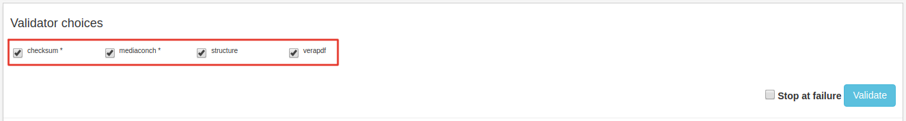
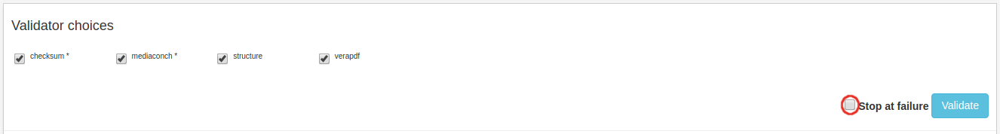
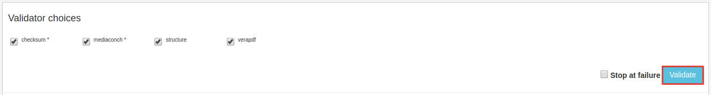
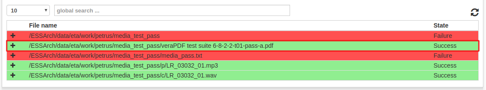
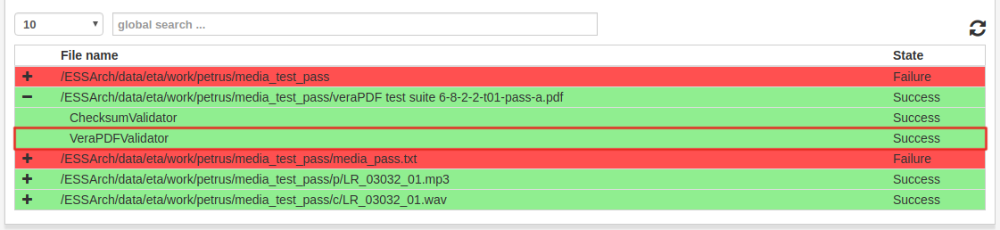
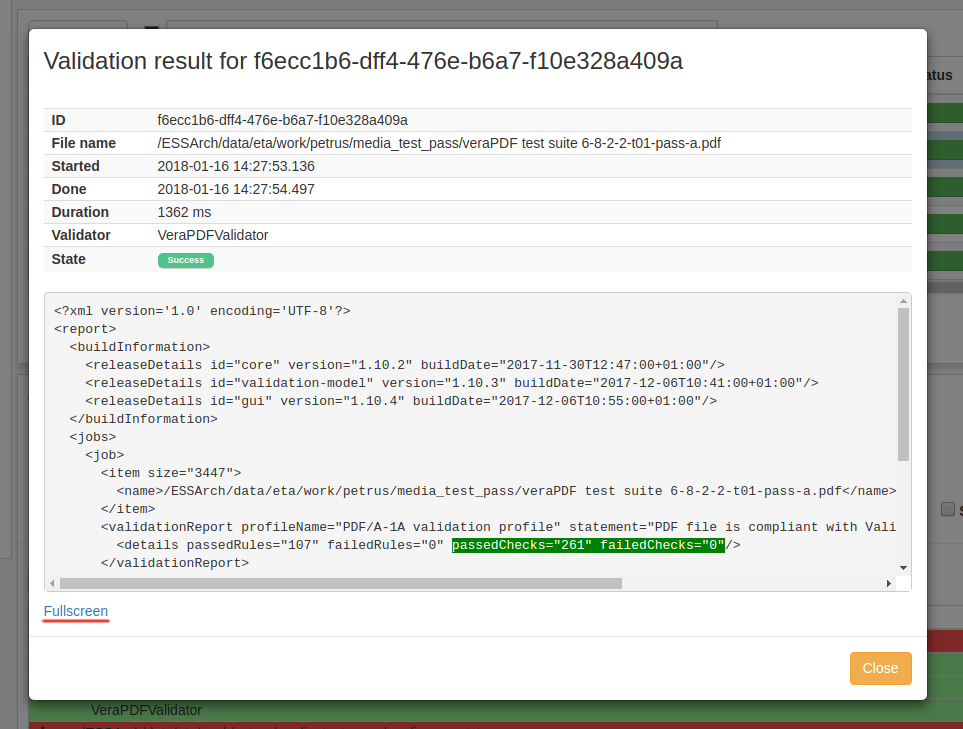
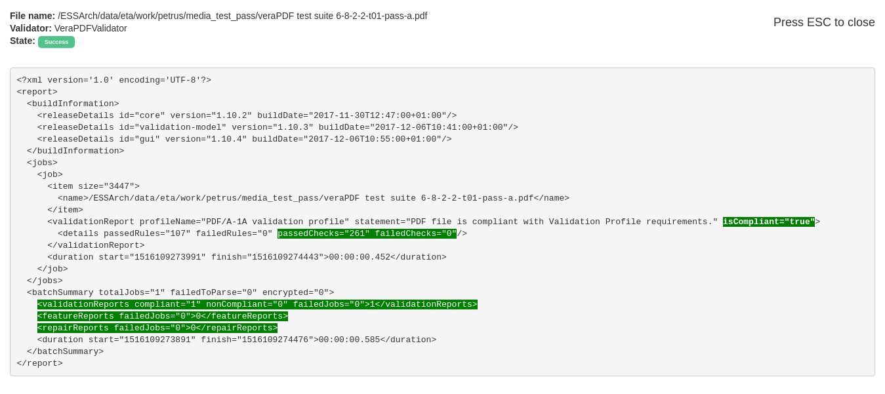
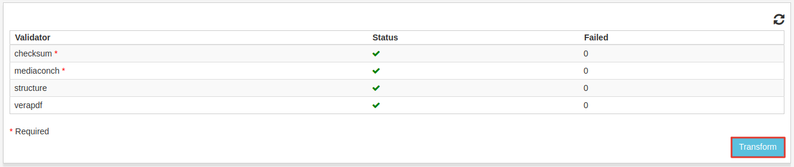

.. _workspace:

**********
Workspace
**********

.. _workspace_validation:

Validation
==========

If an IP is related to a submission agreement that ha a validation profile,
the IP can be validated.
Click and IP in the list view to see the validation options.

There is a list of validations to choose from that is defined
by the validation profile.
Validators defined as required in the profile are marked with a \*.
Required validators must pass before the IP can be
:ref:`transformed <workspace_transformation>`.

Check the **Stop at failure**-checkbox to make the validation process
stop at the first failure.

When validators are chosen click the **validate**-button and the validation
process will begin.

The validation results are shown in the table and will automatically refresh
when all validations are done.
Successfull validations are marked with a green color and unsuccessful
validations are marked with red. Files with only successful validations
are marked with green and files that has at least one failed validation
are marked with red.
The validations are shown in the following structure:
    * File
        * Validator 1
        * Validator 2
        ...
    ...
Click on a row to expand the file to see the validators and
click again to collapse and hide validators.

The rows representing validators can be clicked to view the validation results.

The results of the validation is showed in a new window.

To view the results in fullscreen click the **Fullscreen**-link,
and press **Esc** to exit fullscreen mode.

.. _workspace_transformation:

Transformation
==============

If an IP is related to a submission agreement that ha a transformation profile
and all required validations have passed, an IP can be transformed.
When clicking an IP in the transformation list view, there is a table showing
the outcome of each validator. If a validator has passed in all cases
it is marked with a green check, and if not, it is marked with a red cross.

.. image:: images/transformation_table.png

If all required validators are successfull, It can be transformed
by clicking the **Transform**-button.

