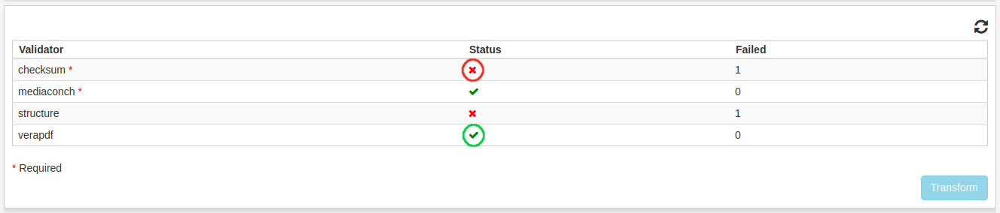

.. _workspace:

**********
Arbetsyta
**********

.. _workspace_validation:

Validering
==========

Om ett IP är relaterat till en lerevansöverenskommelse som har en
valideringsprofil, så kan det bli validerat.

Det finns en lista av olika valideringar som kan genomföras som är
definerade i valideringsprofilen.
Valideringar definerade som obligatoriska är markerade med en \*.
Obligatoriska valideringar måste genomföras innan ett IP kan bli
:ref:`transformerat <workspace_transformation>`.

.. image:: images/validation_choices.png

Markera **Stoppa vid fel** för att stoppa validering när första felet uppstår.

.. image:: images/validation_stop_at_failure.png

När önskade valideringar är valda, klicka på **Validera**.
Då börjar valideringsprocessen.

.. image:: images/validation_validate_button.png

Valideringsresultaten visas i tabellen och uppdateras automatiskt
när alla valideringar är färdiga.
Lyckade valideringar markeras med grön färg och misslyckade med röd färg.
Filer med enbart lyckade valideringar markeras med grön färg och
filer med minst en misslyckad validering markeras med röd färg.
Valideringarna visas med följande struktur i tabellen:
    * Fil
        * Validator 1
        * Validator 2
        ...
    ...
Klicka på en rad för att expandera en fil och se alla valideringar för filen.
Klicka igen så kommer fil-raden minimeras och valideringarna kommer försvinna.

Raderna som representerar en validering kan klickas för att se
detaljerat resultat,

.. image:: images/validation_open_result.png

valideringsresultatet visas i ett nytt fönster.

.. image:: images/validation_result.png

För att se resultatet i fullskärmsläge klicka på **Fullskärm**-länken.
Klicka **Esc** för att gå ur fullskärmsläget.

.. _workspace_transformation:

transformering
==============

Om ett IP är relaterat till en leveransöverenskommelse som har en
transformeringsprofil och alla obligatoriska valideringar är lyckade,
kan ett IP bli transformerat.
När man klickar på ett IP i listvyn under transformering får man se
en tabell med valideringsresultat.
Om en validator har klarat alla filer den har validerat är den markerad
med en grön bock, om inte, är validatorn markerad med ett rött kryss.

Om alla obligatoriska valideringar har lyckats kan IPt transformeras
genom att klicka på **Transformera**.

.. image:: images/transformation_transform_button.png
